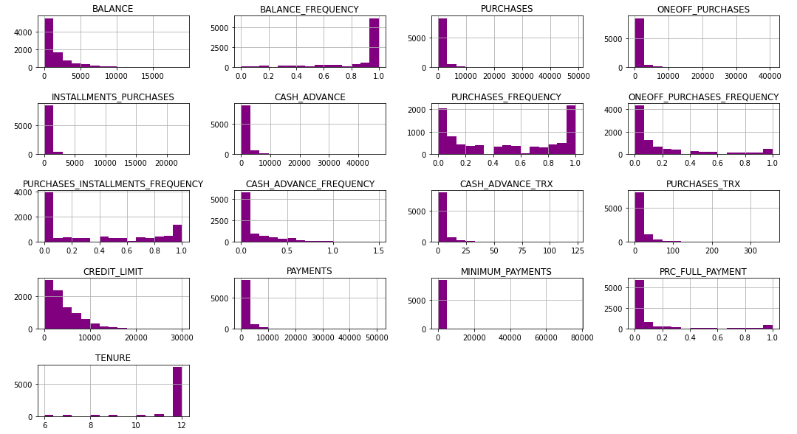
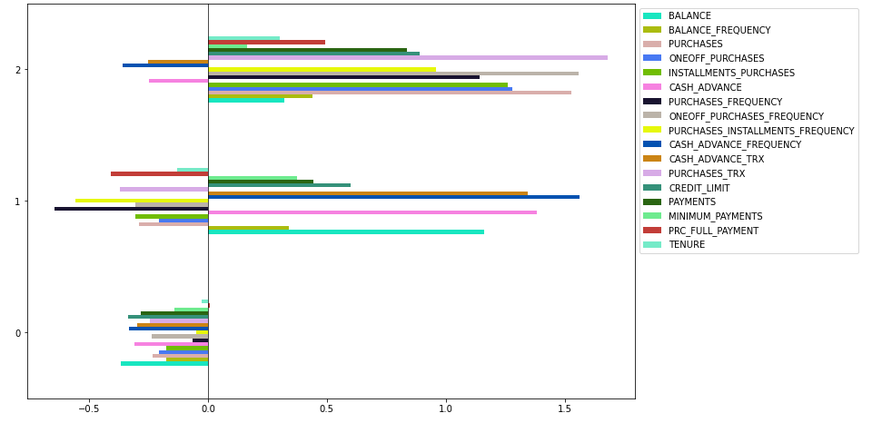
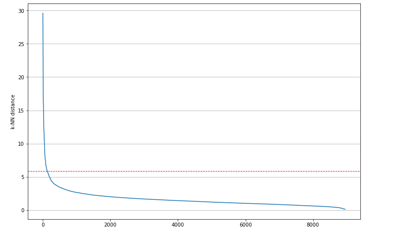
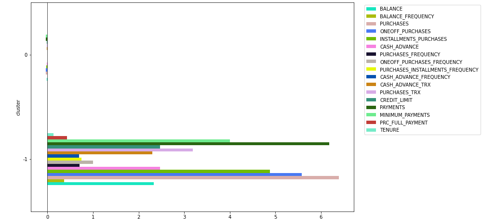
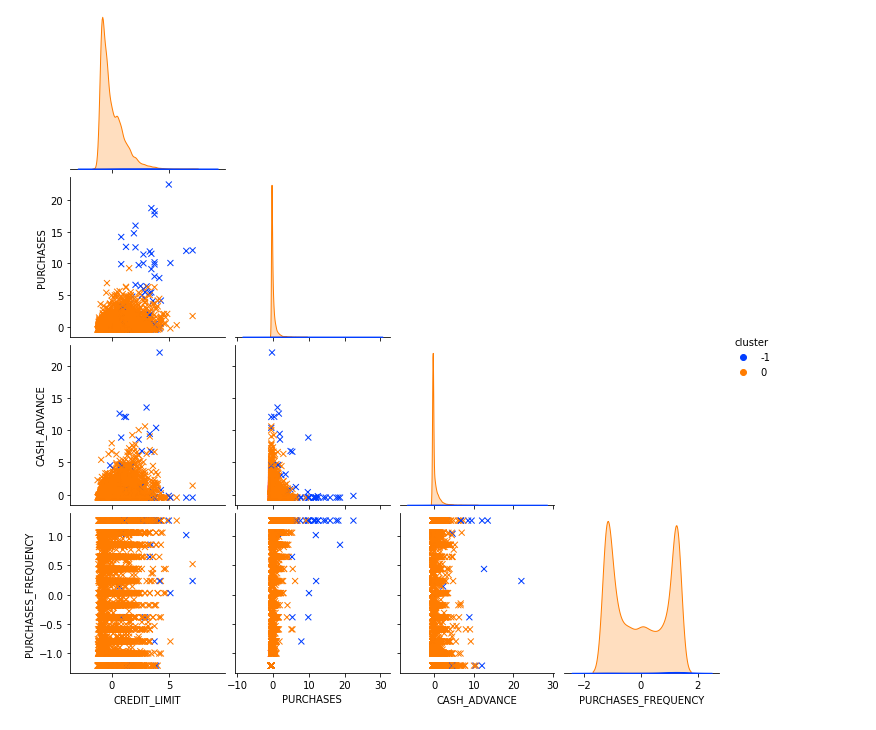
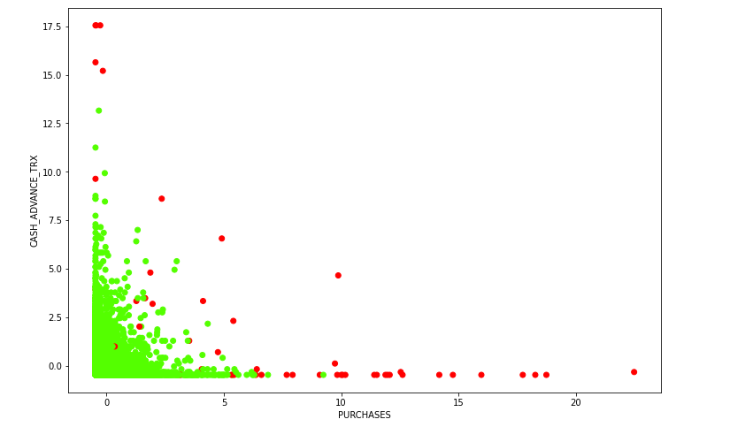
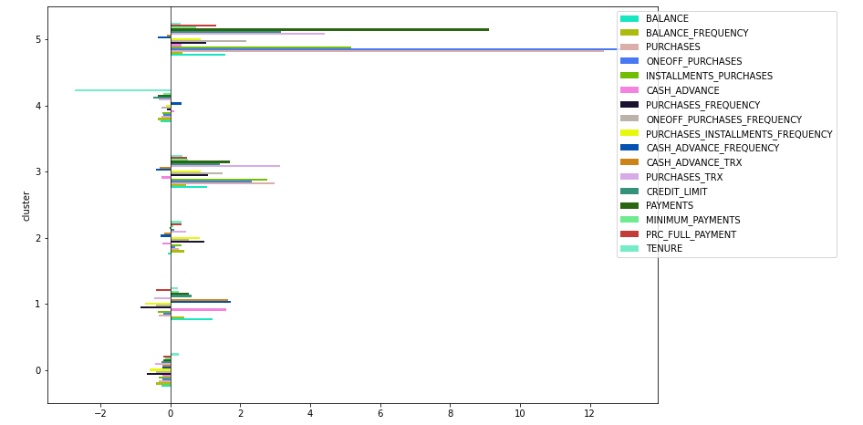
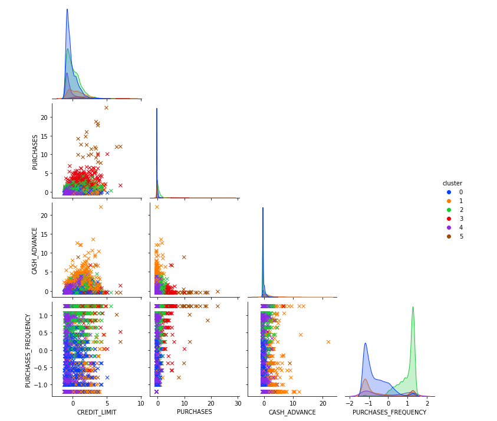

<h1>Segmentation of credit card users</h1>

<h2>Table of contents</h2>

- [Objective](#objective)
- [Data source](#data-source)
- [Features](#features)
- [Methods](#methods)
- [Teck stack](#teck-stack)
- [Results](#results)
  - [EDA](#eda)
  - [Cluster Analysis](#cluster-analysis)
- [Model comparison](#model-comparison)
- [Summary](#summary)

## Objective

One of the most popular and common activities these days is the buy/sell transaction. Although it would have seemed impossible a dozen years ago, it is now possible to buy food, clothing, household appliances and other products without moving from home. Mobile banking, in the broadest sense of the word, has played a huge part in this process.  In order to understand customer attitudes by analysing their behaviour, a segmentation of credit card users was carried out. In order to analyse customer behaviour and create a helpful strategy regarding the individual ‘elements’ of credit cards, cluster analysis was carried out using Ward's methods, k-means and DBSCAN.

## Data source

Data was obtained from [Kaggle](https://www.kaggle.com/datasets/arjunbhasin2013/ccdata).

## Features

| Variable                       | Description                                                                                                                   |
|--------------------------------|-------------------------------------------------------------------------------------------------------------------------------|
| CUST_ID                        | Identification of Credit Card holder (Categorical)                                                                            |
| BALANCE                        | Balance amount left in their account to make purchases                                                                        |
| BALANCE_FREQUENCY              | How frequently the Balance is updated, score between 0 and 1 (1 = frequently updated, 0 = not frequently updated)             |
| PURCHASES                      | Amount of purchases made from account                                                                                         |
| ONEOFF_PURCHASES               | Maximum purchase amount done in one-go                                                                                        |
| INSTALLMENTS_PURCHASES         | Amount of purchase done in installment                                                                                        |
| CASH_ADVANCE                   | Cash in advance given by the user                                                                                             |
| PURCHASES_FREQUENCY            | How frequently the Purchases are being made, score between 0 and 1 (1 = frequently purchased, 0 = not frequently purchased)   |
| ONEOFFPURCHASESFREQUENCY       | How frequently Purchases are happening in one-go (1 = frequently purchased, 0 = not frequently purchased)                     |
| PURCHASESINSTALLMENTSFREQUENCY | How frequently purchases in installments are being done (1 = frequently done, 0 = not frequently done)                        |
| CASHADVANCEFREQUENCY           | How frequently the cash in advance being paid                                                                                 |
| CASHADVANCETRX                 | Number of Transactions made with "Cash in Advanced"                                                                           |
| PURCHASES_TRX                  | Number of purchase transactions made                                                                                          |
| CREDIT_LIMIT                   | Limit of Credit Card for user                                                                                                 |
| PAYMENTS                       | Amount of Payment done by user                                                                                                |
| MINIMUM_PAYMENTS               | Minimum amount of payments made by user                                                                                       |
| PRCFULLPAYMENT                 | Percent of full payment paid by user                                                                                          |
| TENURE                         | Tenure of credit card service for user                                                                                        |

## Methods
- Exploratory Data Analysis
  - Distribution of variables
  - Correlation of variables
- Data engineering
  - Data imputation
  - Data scaling
- Cluster analysis
  - K-Means
  - DBSCAN
  - Ward method 

## Teck stack

- Python (refer to `requirements.txt` for the packages used in this project)

## Results

### EDA

**Distribution of variables**

Almost all variables are characterised by high asymmetry. An interesting case is the variable describing shopping frequency. Here we are dealing with a bimodal distribution. Apart from an interesting statistical observation, this allows the thesis that there are two ‘groups’ in the analysis - those who shop infrequently (or even not at all) and those who shop very frequently.

**Correlation analysis**

The next step was to create a correlation matrix between the variables. It can be seen that most of the variables are characterised by low absolute values of Spearman correlation coefficients. Except in some cases, this leads us to believe that each variable carries different information about the phenomenon under study.

**Conclusions of the basic analysis**:

- Many columns have a substantial number of zeros, which means, among other things, that many customers do not buy anything with the card, It is worth mentioning that there are a lot of customers with a balance value close to or equal to zero - it can be assumed that they keep their balance low in order to obtain, among other things, a high credit rating
- In a significant number, the distributions of the variables are right-skewed (for example, balance), i.e. the mean significantly exceeds the median
- Some of the columns are highly correlated with each other, most of which the association is quite logical, such as the number of transactions via cash advance and the frequency of use of cash advance

### Cluster Analysis

**K-Means**

The optimal number of clusters could not be easily deduced on the basis of the elbow method. Therefore, the number of clusters for the k-means method was selected using a silhouette index. Based on the silhouette score, it was decided to use **three clusters** in the k-means method.

The mean values of the individual variables in the clusters provide an understanding of the ‘criteria’ for the division into clusters. Objects that were characterised by negative mean values (standardised) were assigned to the ‘zero’ cluster. Cluster ‘one’ was characterised by high values for variables related to payment by cash advance. In contrast, cluster ‘two’ was dominated by high values for the variables number of transactions and frequency of one-off purchases.

Based on the charts, customers can be divided into three segments:
- **The ‘safe’ segment (68%)** - many customers do not buy much with the card, and have balances close to or equal to zero - it can be assumed that they keep their balances low in order to obtain, among other things, a high credit rating
- **The ‘borrowers’ segment (18%)** - these are customers who frequently use a cash loan - they can be considered riskier customers
- **The ‘shoppers’ segment (14%)** - as the name suggests, these are customers who frequently use a credit card, who like to shop frequently and for large amounts, and who therefore also have a higher card limit.

**DBSCAN**

The kneed package was used to determine the optimal value of the epsilon parameter. Given a set of `x` and `y` values, `kneed` will return the knee point of the function. The knee point is the point of maximum curvature. To two decimal places, the epsilon value was `5.88`.

With DBSCAN, the division into clusters is fairly straightforward. To the `0` cluster, objects were assigned that showed values close to zero for most variables. To the `-1` cluster, objects with much greater values. From `pairplot` it can be seen that clients from `-1` cluster are more frequent buyers in general whereas in `0` cluster distribution of purchase frequency is bimodal - there are a lot of customers who buy very rarely and a lot of customers who buy more frequently.

An example visualisation of how the DBSCAN algorithm works was applied to the variables: number of transactions using cash advance and amount of purchases made from the account. The algorithm assigned the vast majority of objects to one grouping. The remaining objects (with a few exceptions) had extremely high values for one variable and very low values for the other.

**Ward Method**

The dendrogram shows a few significant vertical jumps, indicating larger distances between clusters. Based on the structure of the dendrogram, it seems reasonable to choose six clusters.

In the case of standardised average values, it is difficult to see clear rules that caused assignment to one group or another.

- **Cluster 0 (blue)**: Characterized by low credit limits, low purchase amounts, and low purchase frequency, with little use of cash advances.
- **Cluster 1 (orange)**: Higher levels of purchases and cash advances, with some of the highest values in both categories.
- **Cluster 2 (green)**: Higher purchase frequency and moderate credit limits, with relatively low cash advances.
- **Cluster 3 (red)**: Moderate to high purchases and cash advances with intermediate credit limits.
- **Cluster 4 (purple)**: Displays moderate values across most features but is not as distinctive as other clusters.
- **Cluster 5 (brown)**: Very high purchase frequency with low cash advance.

## Model comparison

| model   | davies_bouldin | silhouette | calinski_harabasz |
|---------|----------------|------------|-------------------|
| k-means | 1.59           | 0.25       | 1608.97           |
| dbscan  | 1.38           | 0.76       | 663.98            |
| ward    | 1.52           | 0.17       | 1066.17           |

On the basis of the above measures, the ‘dissimilarity’ of the DBSCAN algorithm is clearly visible. On the one hand, it is characterised by a high (and, compared to the other two methods, even very high) silhouette index, but this is accompanied by a low value of the Calinski-Harabasz index.

## Summary

As mentioned at the beginning, the aim of the analysis was to segment customers and make recommendations on the use of payment cards (more broadly: mobile banking). Quite a lot of information can already be ‘extracted’ about this from the histograms. The customers' preference for the length of credit card use is very apparent. The vast majority of customers are in favour of a twelve-month term. Unfortunately, in the dataset analysed, a significant proportion of customers did not transact, so it is difficult to draw far-reaching conclusions in this situation. In selecting a strategy, it is worth bearing in mind the diversity of customers in terms of their propensity to buy on instalments and their overall frequency of transactions. Also worth noting is the wide variation in card limits. The maximum values reach almost `20,000`, but on the basis of all the data, the optimal limit seems to be `10,000`.